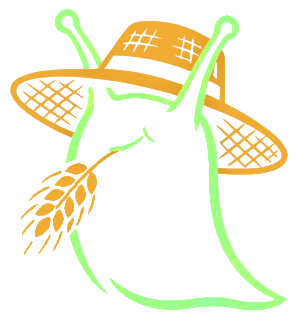

<div align="center">
  
  <h1>Slug Farm</h1>
</div>

> **Status:** “Works for me” beta, **pre-alpha ideation** for basically everyone else.  
> For my personal centralized task scheduling, this is effectively **beta** (it does what I need).  
> For a broader audience / general-purpose library use, it’s **early alpha at best**, and honestly closer to **pre-alpha ideation**.

---

## “Slug” 

Package gets its name because the original idea was to boil any granule of functionality to string(the slug, in a strict sense) a command, and kwargs.

- The **object** is a `Slug` (or `BashSlug`, `RequestSlug`, etc.).
- The **slug** (conceptually) is the *name* used to address that object inside a registry.


So the “slug” is ultimately **the registry key**, which is a slug in the strict sense for the functionality

---

## What this is

Slug Farm is a framework for reducing disparate kinds of work into one callable shape:

```python
result = some_slug(command="...", task_kwargs={...})
```

There is also a SlugRegistry which holds these slugs further abstrating the slug to an identifiable string

`result` is intended to always be a `SlugResult`


### Core Use Case

I built this for **centralized task scheduling**, where I want to call tasks across **REST APIs** and **shell environments** etc.  This allows me to keep tasks **in a database** in an easily patchable form.  I can also define large collections of tasks quickly by “walking” through and capturing all viable intermediates as functions, which is especially helpful with bash-like command structures or API endpoint trees.

The real value is persistence + uniformity:

> Any task becomes: **(slug name (str), command (str), kwargs (dict))**

---

### Discovered Benefit

Once you get the hang of it, declarating a tree of functions is quite streamlined and readable.  I've been able to write python functions for a tree RestAPI endpoints in a way that is clear to understand and maps quite cleanly to the APIs Swagger documentation.

## The Challenge

To support this minimal branching declaration 

If you’re thinking:
- “I need a way to call a bunch of operations”
- “I want structured access to a set of endpoints”
- “I want composable function calls”

…then again: **a dictionary of functions is probably better.**  
It’s simpler, clearer, easier to type-check, easier to debug, and WAYY less opinionated.

The “juice” you get from Slug Farm is real, but the “squeeze” is learning a structure that is necessarily rigid and ultimitely quite arbitrary.

---

## What’s in here right now

### BashSlug
Builds a command + flags list and executes with subprocess.

- Intentionally does **not** interpret pipes or shell operators.
- Literal `|` is treated as an argument, not an operator (this is a security decision).

### RequestSlug
Builds an HTTP request using requests, with inherited URL segments, params merging, and JSON-body logic.

- Supports placeholders like `/crops/{crop_name}`. Which can be "intelligently" (hopefully) replaced with kwargs during call
- GET carries params; POST/PUT/PATCH carry params and JSON bodies (with filtering support).

### UDP_Slug
Sends UDP payloads (optionally in bursts) with a shared UUID per run.

### PythonSlug
Wraps a Python callable so it fits the same (command, task_kwargs) invocation style. 
This exist entirely if you're benefitting heavily from the SlugRegistry for Bash and Request and would like use the same structure for Python slugs.
This would be quite silly to use in a vacuum.

---

## Registry (the part that makes the naming make sense)

The registry concept is the “why” behind the name Slug Farm:

- the Slug object is the implementation
- the slug name is the address (registry key)
- the registry is what makes tasks easy to store/replay/patch

Right now:
- A SlugRegistry exists, but it’s not fully built out into the persistence-oriented system I want.
- I still need to expand this area and add tests around it.
- YAML declarative registry would be cool.  Ways to inject custom slug classes into declarative yaml are being currently mulled over.

---

## Installation

```bash
pip install slug_farm
```

From source:
```bash
git clone <repo>
cd SlugFarm
pip install -e ".[dev]"
```

---

## Quickstart

### BashSlug (dry run)

```python
from slug_farm import BashSlug

git = BashSlug(name = "git", command = "git")
status = git.branch(branch_name = "status", command="status")

result = status(task_kwargs = {'untracked-status': 'no', 's': True})  # executes "git status -s --untracked-status no"

```

### RequestSlug (dry run)
```python
from slug_farm import RequestSlug

api = RequestSlug(
    name = "api", 
    base_url="https://example.com/v1", 
    headers = SOME_HEADERS_DEFINED_ELSEWHERE
)
crops = api.branch(  # Inherits headers, params, etc. Default method is GET
    branch_name = "crops", 
    url_segment="crops"
)

get_result = crops(task_kwargs={"limit": 10})

add_crops = crops.branch(
    branch_name= "add",
    url_segment="add",
    method="POST"
)

add_crops(task_kwargs = {"apples": 10}) # Sends a post request to https://example.com/v1/crops/add, presumably to add 10 apples.

 # Here is where shoehorning RestAPI requests into (command, kwargs)-only structure adds some clunk.  
 # exclude_params makes sure the crop_id param isn't passed and is only swapped in the url placeholder
 # If the endpoint is okay getting it as a param too you don't need to bother
get_specific = crops.branch(
    branch_name = "specific",
    url_segment="{crop_id}",
    exclude_params="crop_id"
)

get_specific(task_kwargs = {"crop_id": "crop_2b67d"}) # Sends a GET request to https://example.com/v1/crops/crop_2b67d, utilizing the placeholder

```
### UDP_Slug

```bash
from slug_farm import UDP_Slug

slug = UDP_Slug(
    "telemetry",
    url="127.0.0.1",
    port=9999,
    burst_size=5, # Will send a burst of 5 identical messages.  All messages within burst will contain the same uuid4 so the listener can deduplicate.
    burst_delay_ms=50,
)

result = slug(task_kwargs={"hello": "world"}) # Command arg is generally excluded.  If you include it to UDP it adds a "message" key and puts your command there.  Should probably just be "command" though. Looking into it eventually
print(result.ok, result.status)
```

---

## Contributing / expectations

If you’re looking at this repo with a “could this be useful?” mindset:

PRs and tests are welcome, especially around:
- registry behavior
- persistence patterns
- clearer docs/examples
- Intelligent and clear error messages.
  - With a structure this opinionated, error messages should be able to be incredibly readable and informative without making it *more* opinionated to support that.  This does not exist yet.
- logging integration
- edge-case safety
- Declarative initiation and hydration
  - Again, one of the benefits of being opinionated is that a 'suite' of slugs might be able to be declared with a simple yaml file, or automatically collected from a script.  This could even potentially be procedurally generated from a Swagger page.
  - Hydrating a slug registry from a YAML also offers the opportunity to pre-inspect a config and surface some more errors/hints of such an opinionated library in a way which is difficult to do with docstrings/linting alone.

---

## License

MIT. See LICENSE.